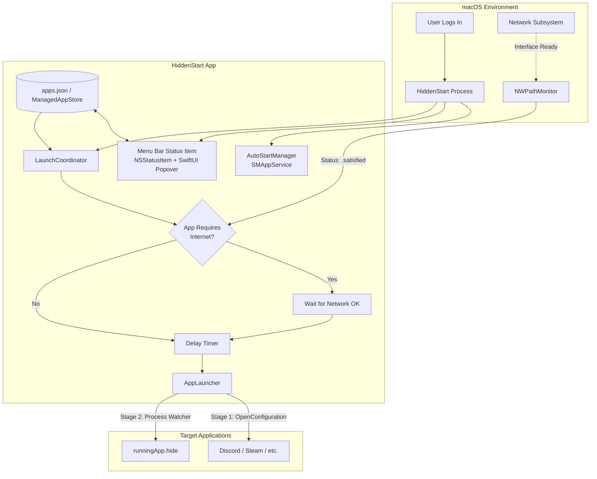

# HiddenStart — System Design Document

**Product:** HiddenStart  
**Platform:** macOS 13.0+ (Ventura, Sonoma, Sequoia)  
**Architecture:** Native Swift 6 / AppKit + SwiftUI  
**Form Factor:** Menu Bar Utility (`LSUIElement`)  

---

## 1. Executive Summary & Problem Statement

### 1.1 The Problem
When a modern Mac (particularly Apple Silicon) boots up or logs in:
1. **Network Race Condition:** The operating system initializes user login items in parallel with Wi-Fi DHCP negotiation and network routing. Apps heavily reliant on internet connectivity (such as **Discord**, **Steam**, **Spotify**, or cloud sync utilities) frequently launch before a stable internet connection is established. This results in failed update checks, fatal "No Internet" dialogues, or offline state locks.
2. **Loss of Native "Launch Hidden" on macOS:** Starting in macOS 13 (Ventura), Apple removed the native "Hide" checkbox from `System Settings > General > Login Items`. Users can no longer configure apps to start minimized or concealed in the background natively.
3. **Window Spam on Boot:** Launching multiple heavy applications simultaneously causes window focus thrashing, screen clutter, and CPU/disk contention during login.

### 1.2 The Solution
**HiddenStart** is a lightweight, background-resident menu bar utility that intercepts the startup process for user-selected applications. It provides:
- **Intelligent Network Gating:** Waits for active, verified internet reachability (`NWPathMonitor`) before triggering network-dependent apps.
- **Customizable Per-App Delays:** Staggers application launches using user-configurable countdown timers (e.g., Discord at 10s, Steam at 20s).
- **Two-Stage Hidden Launching:** Uses native `NSWorkspace` configuration complemented by post-launch process suppression to ensure stubborn Electron/Chromium windows (like Discord and Steam) stay hidden or minimized.
- **Minimal Footprint:** Resides strictly in the macOS menu bar (`LSUIElement = true`) with near-zero idle CPU usage and under 25 MB RAM.

---

## 2. System Architecture



### 2.1 Technology Stack

| Layer | Technology | Rationale |
| :--- | :--- | :--- |
| **Language** | Swift 6 | Native macOS language; memory safety, concurrency, zero-overhead OS integration. |
| **UI Framework** | SwiftUI + AppKit | SwiftUI for rapid, modern declarative components; AppKit (`NSStatusItem`, `NSPopover`) for exact menu bar window anchoring. |
| **Network Detection**| `Network.framework` (`NWPathMonitor`) | System daemon-level network route monitoring without external pings. |
| **Process Management**| `AppKit` (`NSWorkspace`, `NSRunningApplication`) | Apple-supported API for launching and inspecting third-party application bundles. |
| **Login Item System**| `ServiceManagement` (`SMAppService.mainApp`) | Modern macOS 13+ standard for self-registering login utilities. |
| **Data Persistence** | `Codable` JSON (`~/Library/Application Support/HiddenStart/apps.json`) | Transparent, easily backed up, and human-readable. |

---

## 3. Core Subsystems & Components

### 3.1 `AutoStartManager` (HiddenStart's Own Login Item)
To orchestrate startup apps, HiddenStart must itself launch at login.
- **Mechanism:** `SMAppService.mainApp.register()` / `unregister()`.
- **Status Sync:** Queries `SMAppService.mainApp.status` to verify whether the user has approved the app in macOS System Settings.
- **Presentation:** A global toggle in the Menu Bar popover: *"Launch HiddenStart at Login"*.

---

### 3.2 `NetworkMonitor` (Smart Network Gate)
Monitors network interface changes and determines when full internet reachability is achieved.
- **Implementation:** Wraps `NWPathMonitor`.
- **Validation Criteria:**
  - `path.status == .satisfied`
  - `!path.isConstrained` (optional check for Low Data Mode)
  - Supports Wi-Fi, Ethernet, and cellular hotspots.
- **Fail-Safe Timeout:** If an app requires internet, but the machine is offline (e.g. airplane mode, no Wi-Fi), a configurable fail-safe timeout (default: 60 seconds) prevents the launch queue from hanging indefinitely.

---

### 3.3 `LaunchCoordinator` & `AppLauncher`
Manages the queue and timing of application launches.

#### The Two-Stage Launch Strategy
Standard Mac applications honor `NSWorkspace.OpenConfiguration.hides = true`. However, Electron apps (Discord) and custom C++ runtimes (Steam) often create their main window after startup and call `focus()` or `orderFrontRegardless()`, overriding the OS hide flag. HiddenStart uses a resilient two-stage strategy:

1. **Stage 1 (Native Launch Request):**
   ```swift
   let config = NSWorkspace.OpenConfiguration()
   config.hides = appItem.launchHidden
   config.activates = false
   if !appItem.arguments.isEmpty {
       config.arguments = appItem.arguments.components(separatedBy: " ")
   }
   NSWorkspace.shared.openApplication(at: appItem.bundleURL, configuration: config) { runningApp, error in
       // Proceed to Stage 2
   }
   ```
2. **Stage 2 (Post-Launch Window Suppression):**
   - If `appItem.launchHidden == true`, a lightweight background task polls `runningApp.isFinishedLaunching` for up to 3 seconds.
   - Once initialized, it invokes `runningApp.hide()`.
   - Preset arguments are also supported (e.g., Steam natively accepts `-silent`, Discord accepts `--start-minimized`).

---

### 3.4 Data Model (`AppItem`)

```swift
import Foundation

public struct AppItem: Identifiable, Codable, Equatable {
    public var id: UUID = UUID()
    public var name: String
    public var bundlePath: String
    public var bundleIdentifier: String?
    public var delaySeconds: Int = 10
    public var waitForInternet: Bool = true
    public var launchHidden: Bool = true
    public var isEnabled: Bool = true
    public var customArguments: String = ""
    public var sortOrder: Int = 0

    public var bundleURL: URL {
        URL(fileURLWithPath: bundlePath)
    }
}
```

---

## 4. User Interface & Experience (UI/UX)

HiddenStart has no standard dock icon or main window. It exists solely as an accessory item in the status bar.

### 4.1 Menu Bar Icon States
- **Idle:** Solid silhouette icon (`eye.slash` or `play.slash`).
- **Waiting/Counting Down:** Subtle animated pulse or badge dot indicating that delayed apps are currently queued.
- **Launching:** Temporary activity indicator.

### 4.2 Popover Layout

```
+-------------------------------------------------------------+
|  [Icon] HiddenStart                           [Launch at Login] [x] |
+-------------------------------------------------------------+
|  Status: 2 apps queued (Discord in 8s, Steam in 18s)         |
+-------------------------------------------------------------+
|  MANAGED APPLICATIONS                                       |
|                                                             |
|  [Icon] Discord                                             |
|         Wait 10s • Wait for Internet • Launch Hidden       |
|         [Edit] [Test] [Toggle]                              |
|                                                             |
|  [Icon] Steam                                               |
|         Wait 20s • Wait for Internet • Launch Hidden (-silent) |
|         [Edit] [Test] [Toggle]                              |
|                                                             |
|  [Icon] Spotify                                             |
|         Wait 5s • No Internet Gate • Launch Hidden          |
|         [Edit] [Test] [Toggle]                              |
+-------------------------------------------------------------+
|  [+ Add Application...]            [Launch All Now] [Quit] |
+-------------------------------------------------------------+
```

### 4.3 App Configuration Sheet / Inspector
When an application is added or edited, an inspector sheet provides:
- **Delay (Seconds):** Slider & Stepper from 0 to 180 seconds.
- **Wait for Internet Connection:** Toggle (`true`/`false`).
- **Launch Hidden:** Toggle (`true`/`false`).
- **Pre-configured App Hints:**
  - If Discord is detected: Suggests `--start-minimized` and "Wait for Internet".
  - If Steam is detected: Suggests `-silent` and "Wait for Internet".
- **Custom Arguments:** Optional text field for power users.
- **Test Button:** Launches the single app immediately with the specified settings for verification.

---

## 5. Security, Permissions & Sandbox Considerations

| Consideration | Strategy |
| :--- | :--- |
| **App Sandbox** | For full local utility power (launching arbitrary binaries from `/Applications` and passing command-line flags), HiddenStart is designed as a **Hardened Runtime, Non-Sandboxed Developer ID application** or an appropriately entitled utility. Sandboxed apps face restrictions when launching external child processes. |
| **Automation Entitlements** | Standard `NSWorkspace.openApplication` does **not** require Accessibility or AppleScript permissions. It uses native macOS LaunchServices. |
| **System Settings Transparency** | Uses `SMAppService.mainApp`, which guarantees that the user sees "HiddenStart" listed transparently in `System Settings > General > Login Items`. |

---

## 6. Edge Cases & Resilience

1. **Mac Resumed from Sleep vs Cold Boot:**
   - HiddenStart differentiates between login launch and system wake. On wake, apps are usually already running, so HiddenStart checks `NSRunningApplication.runningApplications(withBundleIdentifier:)` before attempting to relaunch an existing process.
2. **Missing or Moved Applications:**
   - If an app in the list was deleted or updated to a new location, HiddenStart verifies `FileManager.default.fileExists(atPath: bundlePath)` and alerts the user with an exclamation badge rather than crashing.
3. **Offline / Airplane Mode Boot:**
   - If "Wait for Internet" is enabled, but Wi-Fi remains off after 60 seconds, a timeout triggers a choice: launch anyway or skip, preventing infinite resource holding.
4. **Immediate Logout / Rapid Restart:**
   - Cancellation tokens (`Task.cancel()`) abort all pending delays cleanly if the user logs out or quits HiddenStart.

---

## 7. Implementation Roadmap

- [ ] **Phase 1: Project Scaffolding & Data Storage**
  - Create native Swift macOS application bundle.
  - Implement `AppItem` model and `ManagedAppStore` (JSON file storage in App Support).
- [ ] **Phase 2: Core Services**
  - Implement `NetworkMonitor` (`NWPathMonitor` wrapper).
  - Implement `AutoStartManager` (`SMAppService` integration).
  - Implement `LaunchCoordinator` (delay queues, cancellation, `NSWorkspace.OpenConfiguration`).
  - Implement two-stage hidden enforcement (`runningApp.hide()`).
- [ ] **Phase 3: User Interface**
  - Build `MenuBarExtra` / `NSStatusItem` container with popover.
  - Build App List view with quick toggles, delay indicators, and status indicators.
  - Integrate `NSOpenPanel` for selecting `.app` bundles from `/Applications`.
  - Build App Settings editor sheet.
- [ ] **Phase 4: Testing & Verification**
  - Verify delay execution and internet gating.
  - Verify hiding behavior with Discord and Steam.
  - Verify `SMAppService` registration on macOS.
