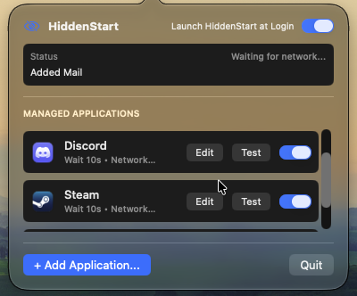
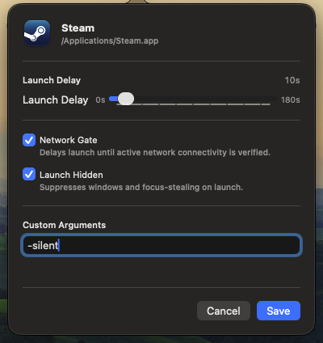

# HiddenStart

HiddenStart is a lightweight macOS menu bar application that controls when and how your login items launch. It prevents offline connection errors, reduces login stutter, and keeps background apps hidden.

[](https://apple.com/macos)
[](https://swift.org)
[](LICENSE)

<p align="center">
  <!-- Primary Demo: Capture the open menu bar popover showing active queued apps and countdowns (suggested size: ~480-520px width) -->
  
</p>

---

## Why HiddenStart?

Starting in macOS 13 (Ventura), Apple removed the native "Hide" option for login items. At the same time, macOS attempts to launch all startup applications simultaneously while network interfaces are still establishing DHCP leases.

For applications like Discord, Steam, and Spotify, this leads to two recurring annoyances:
* Apps open before Wi-Fi or Ethernet is ready, throwing connection errors or stalling in offline mode.
* Windows immediately pop up across your desktop on login, interrupting your workflow.

HiddenStart runs quietly in your menu bar, holding back selected applications until your internet connection is active, staggering their launches, and ensuring their windows stay hidden.

---

## Features

* **Network Gating:** Uses system network monitoring to delay opening network-dependent apps until an internet connection is established.
* **Custom Startup Delays:** Staggers application launches between 0 and 180 seconds to reduce CPU and disk thrashing on boot.
* **Two-Stage Window Suppression:** Keeps applications hidden on startup, including Electron and Chromium apps that ignore standard launch flags.
* **Focus Guard:** Monitors processes during launch to stop background apps from stealing keyboard and window focus.
* **Application Presets:** Automatically detects recognized apps (such as Discord and Steam) and applies recommended launch flags and delays.
* **Deferred Retry:** If the machine boots without internet, network-gated apps enter an observation queue and launch automatically once a connection is detected.
* **Low Footprint:** Lives purely in the menu bar (`LSUIElement`), using under 25 MB of memory and near-zero idle CPU.

---

## Screenshots

<p align="center">
  <!-- Screenshot 1: Menu Bar Popover showing list of managed applications with delay and network indicators -->
  
  <!-- Screenshot 2: App Inspector sheet showing delay slider, network gate toggle, and custom arguments -->
  
</p>

---

## Requirements

* macOS 13.0 (Ventura) or later
* Apple Silicon or Intel 64-bit processor

---

## Getting Started

1. Open HiddenStart from your Applications folder. The app will appear in your menu bar.
2. Click the menu bar icon and select **Add Application**.
3. Choose an app from `/Applications`. HiddenStart will automatically apply presets if the app is recognized.
4. Adjust the launch delay slider and toggle **Wait for Internet** or **Launch Hidden** as desired.
5. Enable **Launch HiddenStart at Login** in the menu bar popover to automate the process.

To test your configuration without logging out, click **Test** next to any configured application.

---

## Building from Source

### Prerequisites

* Xcode 15.0 or later (or Command Line Tools with Swift 6.0)
* [XcodeGen](https://github.com/yonaskolb/XcodeGen) (optional, for regenerating Xcode project files)

### Option 1: Swift Package Manager

Clone the repository and build the binary:

```bash
git clone https://github.com/MZEryani/HiddenStart.git
cd HiddenStart
swift build -c release
```

Run the unit test suite:

```bash
bash scripts/test.sh
```

### Option 2: Xcode

Generate the `.xcodeproj` file and open it:

```bash
xcodegen generate
open HiddenStart.xcodeproj
```

In Xcode, select the **HiddenStart** scheme and press **Cmd + R** to run, or **Cmd + U** to run tests.

---

## Configuration

Configuration is saved as a single JSON file in your user Application Support directory:

```text
~/Library/Application Support/HiddenStart/apps.json
```

You can inspect or back up this file directly. Changes made through the menu bar interface update this file automatically.

---

## How It Works

* **Startup Coordination:** HiddenStart registers through `SMAppService.mainApp`, allowing macOS to launch it cleanly at login without background daemons or helper scripts.
* **Network Detection:** Reachability is tracked using Apple's `Network.framework` (`NWPathMonitor`), querying local socket state without sending network pings.
* **Suppression Strategy:** HiddenStart first requests a hidden launch via `NSWorkspace.OpenConfiguration`. A background watcher then monitors the application for 20 seconds, catching late window spawns without requiring macOS Accessibility permissions.

Technical design documents and decision records are available in `docs/adr/` and `DESIGN.md`.

---

## Contributing

Contributions are welcome. If you find a bug or have a feature request:

1. Open an issue on GitHub describing the behavior or proposal.
2. For code changes, fork the repository, create a feature branch, and submit a pull request.
3. Ensure all unit tests pass by running `bash scripts/test.sh` before submitting.

---

## License

This project is licensed under the MIT License. See [LICENSE](LICENSE) for details.
