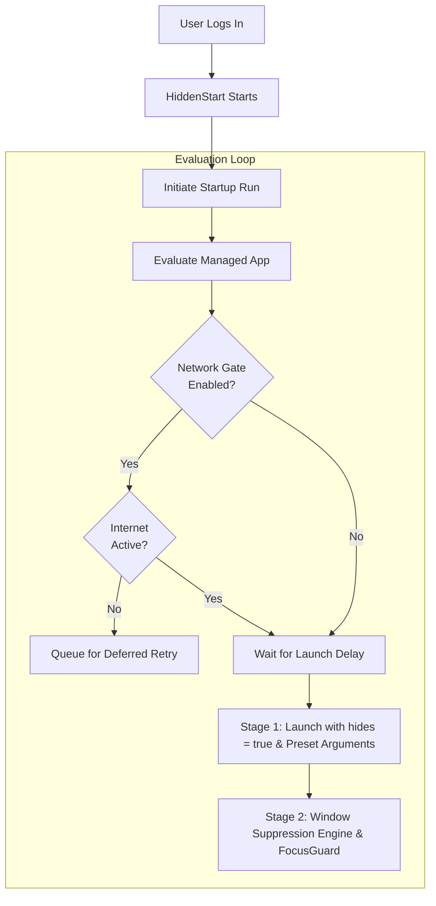

# HiddenStart

A lightweight background-resident macOS menu bar utility that manages application startup on login with intelligent network gating, custom launch delays, and multi-stage window suppression.

[](https://apple.com/macos)
[](https://swift.org)
[](LICENSE)

---

## The Problem

When modern Macs boot up or log in:

1. **Network Race Conditions:** macOS starts login items in parallel with Wi-Fi DHCP negotiation and network routing. Applications that depend on immediate internet connectivity (e.g., Discord, Steam, Spotify) often launch before connection is established, resulting in failed update checks, fatal "No Internet" dialogs, or offline locks.
2. **Loss of Native "Launch Hidden" on macOS 13+:** Starting in macOS 13 (Ventura), Apple removed the native "Hide" checkbox from `System Settings > General > Login Items`. Users can no longer natively configure applications to start minimized or concealed.
3. **Window Spam & Focus Stealing:** Launching multiple heavy apps at once leads to window focus thrashing, screen clutter, and CPU/disk contention during login.

## The Solution

**HiddenStart** intercepts and orchestrates the launch sequence for your configured applications:

* **Intelligent Network Gate:** Monitors network routing via `NWPathMonitor` and holds back network-dependent apps until active internet connectivity is verified.
* **Custom Launch Delays:** Staggers application launches with per-app configurable timers (0–180 seconds) to eliminate login thrashing.
* **Multi-Stage Window Suppression:** Enforces hidden launch states using native `NSWorkspace.OpenConfiguration` combined with a non-intrusive post-launch suppression engine and a multi-process `FocusGuard` that tames stubborn Electron and Chromium apps without requiring invasive Accessibility permissions.
* **Deferred Retry:** Employs a bounded observation window following an offline startup run to trigger skipped network-gated apps as soon as connectivity is restored.
* **Built-In App Presets:** Automatically detects recognized applications (such as Discord and Steam) and applies optimal arguments (`--start-minimized`, `-silent`) and settings.
* **Ultra-Lightweight Footprint:** Operates strictly as a menu bar accessory (`LSUIElement = true`) with near-zero idle CPU usage and under 25 MB RAM.

---

## How It Works



### Window Suppression & FocusGuard

Standard macOS apps respect `NSWorkspace.OpenConfiguration.hides = true`. However, Electron apps (like Discord) and custom runtimes (like Steam) frequently spawn windows asynchronously and steal focus seconds after launch.

HiddenStart solves this via a resilient, non-intrusive two-stage pipeline:
1. **Stage 1 (Launch Configuration):** Launches the app with `hides = true`, `activates = false`, and injected CLI flags (e.g., `--start-minimized` or `-silent`).
2. **Stage 2 (Focus Guard & Window Suppression):** A background watcher monitors the process during a 20-second grace window, catching asynchronous window activations with a 2-strike suppression threshold without interfering with intentional user interaction.

---

## Domain Concepts

To ensure clarity and consistency throughout the codebase, HiddenStart adheres to the following domain vocabulary:

| Concept | Description |
| :--- | :--- |
| **Managed App** | An application configured within HiddenStart to be launched on login. |
| **Startup Run** | The automated launch cycle initiated when the user logs in that evaluates and launches managed apps. |
| **Network Gate** | The reachability condition that delays an app's launch until active internet connectivity is verified. |
| **Launch Delay** | The duration in seconds to wait before launching an app during a Startup Run. |
| **Window Suppression** | The multi-stage technique used to prevent an app's UI from stealing focus or appearing on screen during launch. |
| **App Preset** | A set of pre-configured default settings (arguments, launch delay, network gate) automatically mapped to recognized managed apps. |
| **Deferred Retry** | The bounded observation window following an offline startup run during which skipped network-gated apps are triggered if connectivity is established. |

---

## Requirements

* **Operating System:** macOS 13.0 (Ventura), macOS 14.0 (Sonoma), macOS 15.0 (Sequoia), or later
* **Architecture:** Apple Silicon or Intel 64-bit
* **Developer Tools:** Xcode 15.0+ and Swift 6.0 toolchain

---

## Building and Development

### Using Swift Package Manager
To build the executable directly:
```bash
swift build
```

To run unit tests:
```bash
bash scripts/test.sh
```

### Using XcodeGen
HiddenStart includes a [`project.yml`](project.yml) specification. To regenerate the Xcode project:
```bash
xcodegen generate
open HiddenStart.xcodeproj
```

---

## Configuration & Storage

HiddenStart stores its user configuration as clean, transparent JSON in your user Application Support directory:

```
~/Library/Application Support/HiddenStart/apps.json
```

Each **Managed App** record stores:
* Display name and bundle path (`/Applications/...`)
* Optional bundle identifier
* Launch Delay in seconds
* Network Gate toggle (`waitForInternet`)
* Window Suppression toggle (`launchHidden`)
* Custom arguments (e.g. `--start-minimized`)
* Enabled state and sort order

---

## Architecture & Design Documents

For in-depth architectural specifications and design decisions:
* [System Design Document](DESIGN.md)
* [Domain Context & Glossary](CONTEXT.md)
* [ADR 0001: Window Suppression Strategy](docs/adr/0001-window-suppression-strategy.md)
* [ADR 0002: Status Item & Popover Architecture](docs/adr/0002-status-item-and-popover-architecture.md)
* [ADR 0003: Non-Sandboxed Developer ID Distribution](docs/adr/0003-non-sandboxed-developer-id.md)

---

## License

This project is licensed under the MIT License — see the [LICENSE](LICENSE) file for details.
